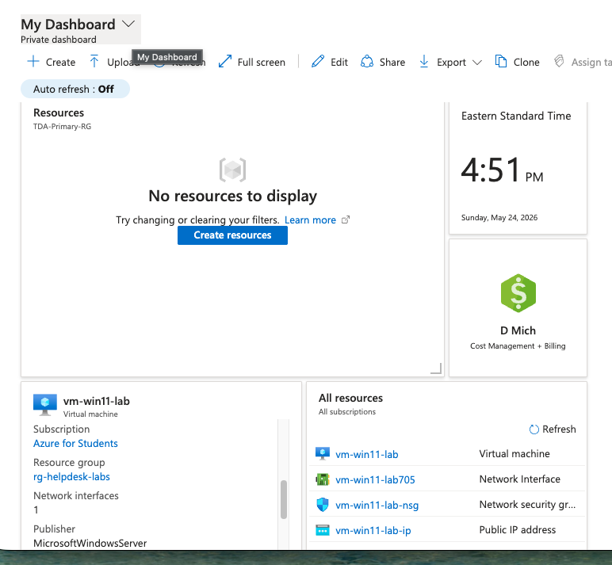
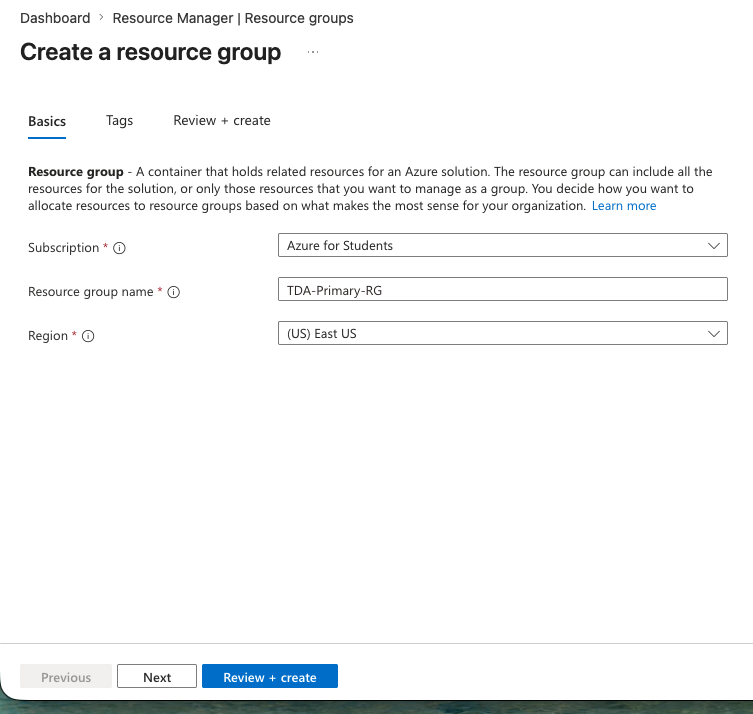
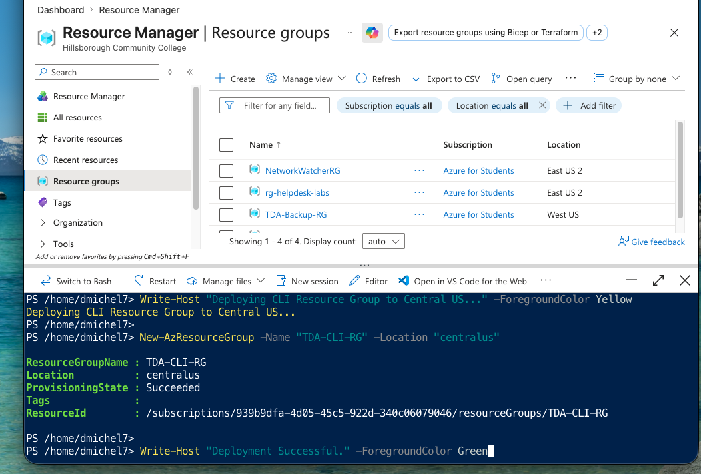
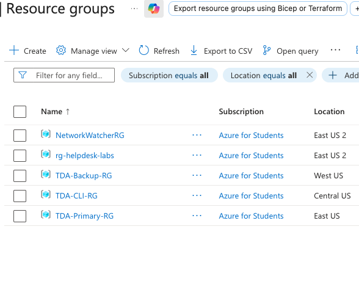

# Lab 01: Resource Hierarchy & Regions

## Overview
Every piece of infrastructure in Azure needs a bucket to live in. These buckets are called **Resource Groups**. You can't build a server, network, or database without one. 

This lab covers how to spin up these core containers, pick the right physical geographic regions to keep speeds fast, and set up the foundation for disaster recovery using Azure's Region Pairs.

## Execution & Logic

### Phase 1: The Portal GUI & Disaster Recovery Setup
First, I used the Azure Portal to set up our primary and backup containers to demonstrate data residency and region pairing.
* **Primary Site:** Created `TDA-Primary-RG` and placed it in **East US**. You always want your primary resources physically close to your users to keep latency low.
* **Failover Site:** Created `TDA-Backup-RG` and placed it in **West US**. Microsoft specifically links East US and West US as a "Region Pair." If a massive power outage hits the East Coast data centers, the West Coast pair acts as the designated backup for disaster recovery.

### Phase 2: Automation with Azure Cloud Shell
Clicking through a GUI is fine for one or two items, but managing cloud at scale requires the command line.
* Fired up **Azure Cloud Shell** directly in the browser.
* Executed the `New-AzResourceGroup` PowerShell cmdlet to instantly deploy a third group (`TDA-CLI-RG`) in the Central US region without touching the graphical interface. 

## Documentation & Assets

**1. Azure Student Environment Baseline** 

**2. Region Selection (East US)** 

**3. PowerShell Execution via Cloud Shell** 

**4. Final Resource Group Hierarchy Verification** 