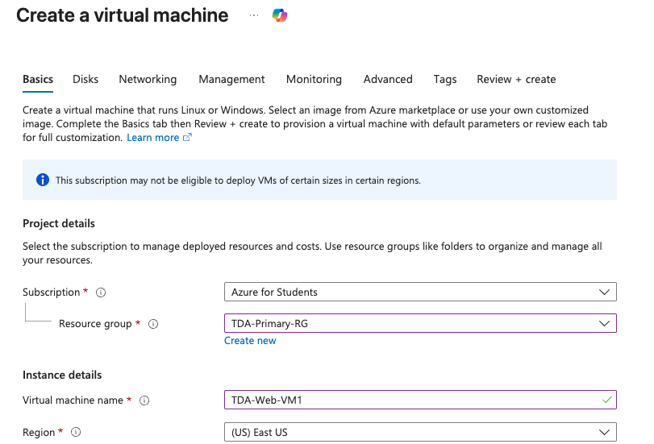
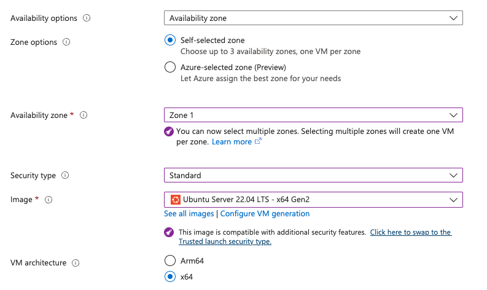
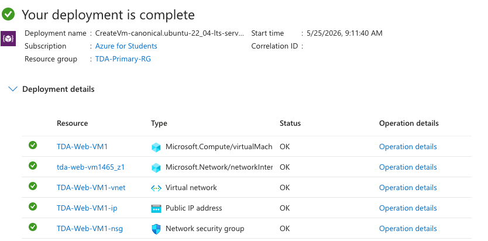

# Lab 02: IaaS & Availability Zones

## Overview
Virtual Machines are the bread and butter of cloud computing. This falls under **Infrastructure as a Service (IaaS)**, which means Microsoft provides the raw hardware, but I am entirely responsible for the operating system, the patching, and the security inside the box. 

This lab documents the deployment of an IaaS workload while specifically configuring physical datacenter redundancy using Availability Zones.

## Real-World Constraints & Troubleshooting
Because I engineered this lab using an **Azure for Students** subscription, I had to architect around strict budget and capacity constraints:
* **vCPU Quota Limits:** Student accounts have a hard cap on global processor cores. Before deploying, I had to audit my global tenant and completely delete a legacy Resource Group to free up the compute quota required for this lab.
* **Capacity Shortages & Region Hopping:** High-demand regions (like East US) frequently run out of low-cost hardware (`B-Series` VMs). To bypass this, I dynamically shifted my deployment to the **South Central US** region (Texas) to find available compute capacity.
* **Availability Zone Architecture:** Not all Azure regions support Availability Zones (e.g., North Central US). Furthermore, deeply discounted "Azure Spot Instances" cannot alwayds be hardcoded to a specific Zone. 

## Execution & Logic

### Phase 1: Resource Placement
* Selected the `TDA-Primary-RG` container I built in Lab 01 to keep my architecture organized and billing centralized. 
* Chose a lightweight Linux image (`Ubuntu Server 22.04 LTS`) and a burstable compute size to keep monthly run-rates low and protect the project budget.

### Phase 2: Configuring Physical Redundancy
* **The AZ-900 Concept:** A Region is a massive geographic area, but an **Availability Zone** is a specific physical building with its own independent power, cooling, and networking. 
* By explicitly assigning this VM to **Zone 1**, I am laying the groundwork for high availability. If I deploy a second server later, I will place it in **Zone 2**. That way, if a localized fire or power failure takes down the Zone 1 datacenter building, my Zone 2 server keeps the business running.

## Documentation & Assets

**1. Virtual Machine Baseline Configuration**  

**2. Availability Zone Selection (Zone 1)**  

**3. Successful IaaS Deployment**  
