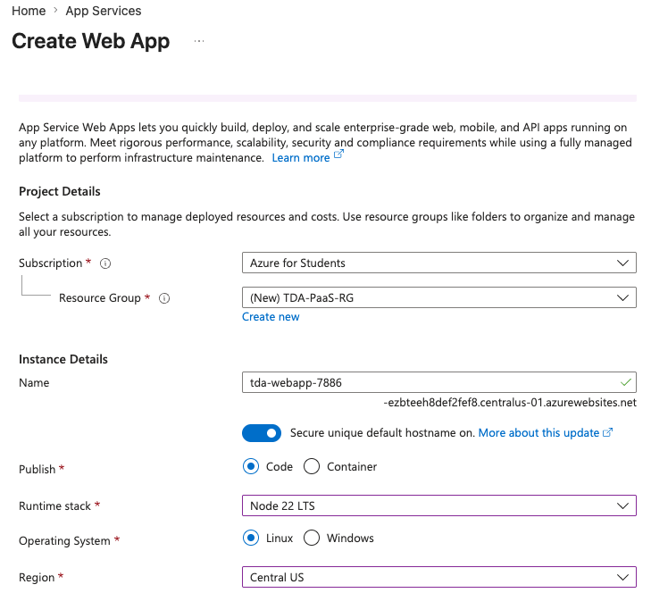
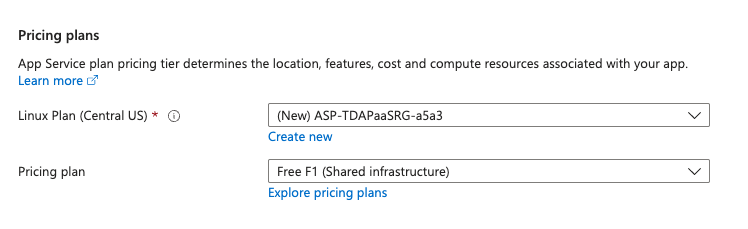
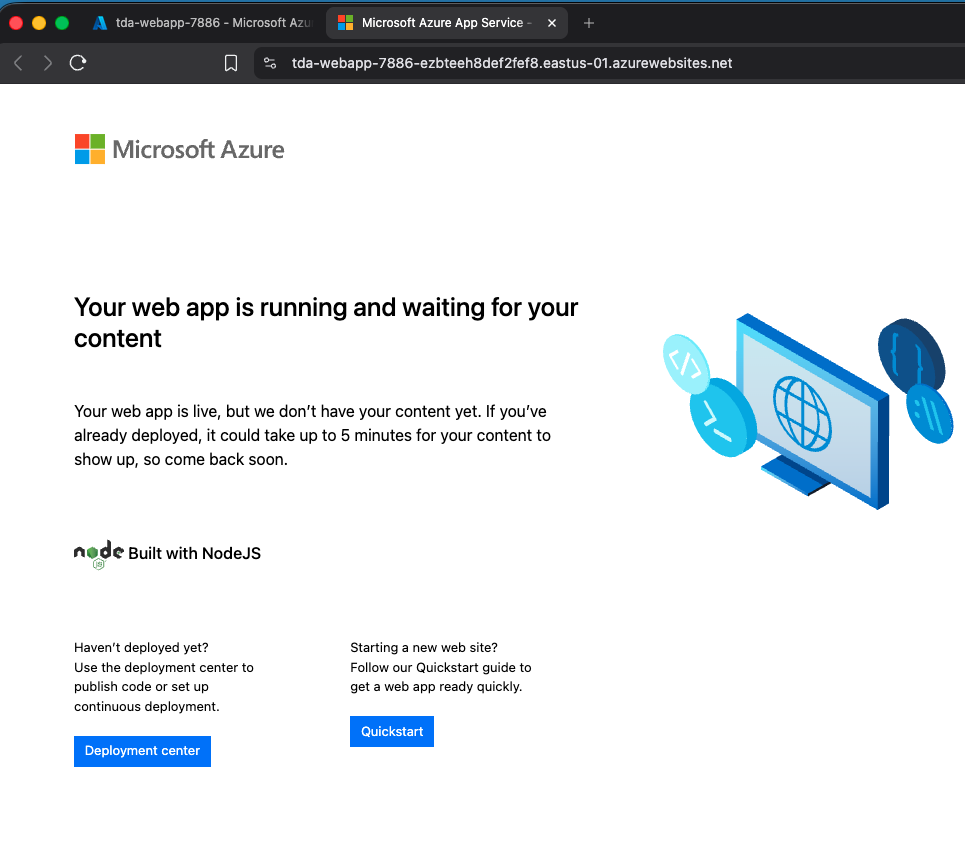

# Lab 03: PaaS & Azure App Service

## Overview
Moving away from the heavy lifting of Virtual Machines, this lab focuses on **Platform as a Service (PaaS)**. 

With PaaS, the cloud provider completely manages the underlying infrastructure—the servers, the operating system, the networking, and the security patches. My only responsibility is deploying the application code. This lab demonstrates how to rapidly deploy a public-facing web application using Azure App Service without ever touching a command-line interface or configuring a server.

## Real-World Constraints & Cost Optimization
To continue protecting the project budget, I engineered this deployment around Azure's shared compute architecture:
* **The App Service Plan:** PaaS applications still require underlying compute power. Instead of provisioning a dedicated, paid tier, I specifically targeted the **Free (F1)** shared infrastructure tier. This allows me to host the application continuously for $0.00 while still demonstrating full PaaS deployment capabilities.
* **Azure Policy Restrictions:** Encountered a subscription-level Azure Policy deployment block. Microsoft actively restricts the deployment of Free (F1) App Service plans in specific high-demand regions (e.g., Central US). Remediated by pivoting the deployment geography to an authorized region while forcing the pricing tier back to shared infrastructure.

## Execution & Logic

### Phase 1: Configuring the Web App
* Created an isolated Resource Group (`TDA-PaaS-RG`) for clean lifecycle management.
* Provisioned an **Azure Web App** utilizing a Linux operating system and a `Node.js` runtime stack. 
* Assigned a globally unique DNS prefix, allowing Azure to automatically generate a public-facing URL (`.azurewebsites.net`) and handle the SSL certificate routing on the backend.

### Phase 2: Deployment & Verification
* Successfully deployed the application and verified public accessibility over the internet, proving that the PaaS model drastically reduces the "time-to-market" for web deployments compared to traditional IaaS.

## Documentation & Assets

**1. Web App Baseline & Runtime Configuration**  

**2. Cost Optimization: F1 Free Tier Selection**  

**3. Live Application Public URL Verification**  
