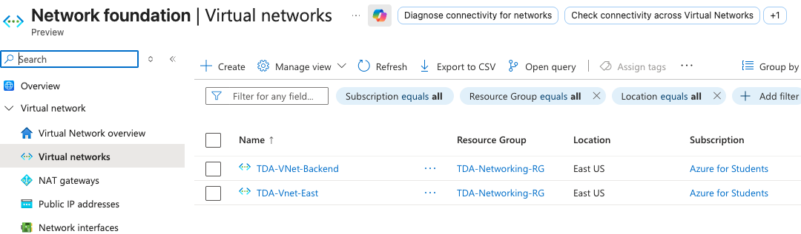
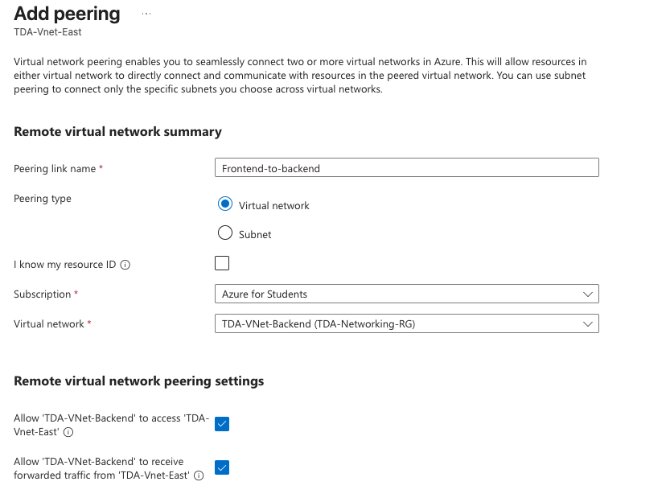
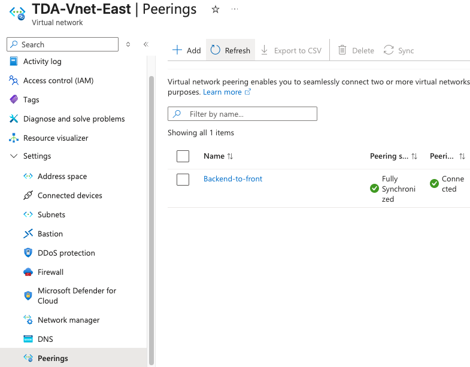

# Lab 04: Virtual Networking & VNet Peering

## Overview
Networking is the central nervous system of cloud infrastructure. By default, Azure Virtual Networks (VNets) are completely isolated boundaries. 

This lab documents the creation of a multi-tier network topology and the implementation of **Local VNet Peering**. Peering establishes a secure, high-bandwidth tunnel between isolated networks, allowing them to route traffic over Microsoft's private fiber backbone without ever exposing the data to the public internet.

## Real-World Constraints & Troubleshooting
* **IP Address Space Overlap:** Attempting to peer two networks with overlapping IP ranges (e.g., both utilizing `10.0.0.0/16`) causes a routing collision. I architected the solution by adhering to RFC 1918 enterprise standards, assigning the frontend VNet to `10.0.0.0/16` and the backend VNet to `10.1.0.0/16` to ensure clean routing.
* **Subscription Region Policies:** Encountered deployment blocks when attempting to provision secondary networks in restricted regions (West US/South Central US) due to Azure for Students capacity policies. Remediated by pivoting from a Global Peering architecture to a Local Peering architecture, successfully deploying both networks in the authorized East US region.

## Execution & Logic

### Phase 1: Multi-Tier Network Provisioning
* Centralized the deployment within a dedicated `TDA-Networking-RG` Resource Group for clean lifecycle management.
* Provisioned `TDA-VNet-East` (`10.0.0.0/16`) to simulate a public-facing Frontend network.
* Provisioned `TDA-VNet-Backend` (`10.1.0.0/16`) to simulate an isolated, secure database or application tier.

### Phase 2: Establishing the Peering Tunnel
* **The AZ-900 Concept:** Because these VNets are separate logical entities, they cannot communicate natively. Routing traffic out to the public internet and back in is slow and introduces severe security vulnerabilities. 
* Configured bidirectional VNet Peering (`Frontend-to-backend` and `Backend-to-front`). This explicitly bridges the two networks, allowing internal private IP addresses to communicate directly and securely.

## Documentation & Assets

**1. Multi-Tier VNet Provisioning**  

**2. Bidirectional Peering Configuration**  

**3. Successful VNet Peering (Connected Status)**  
