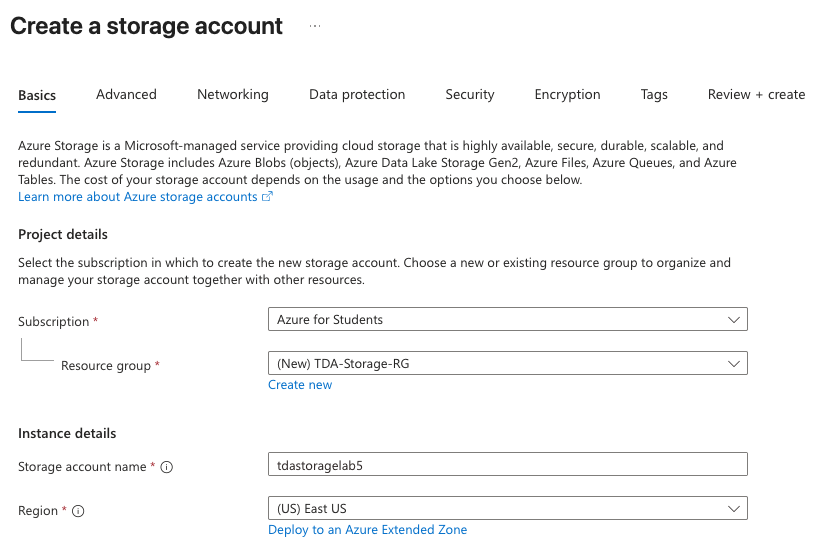
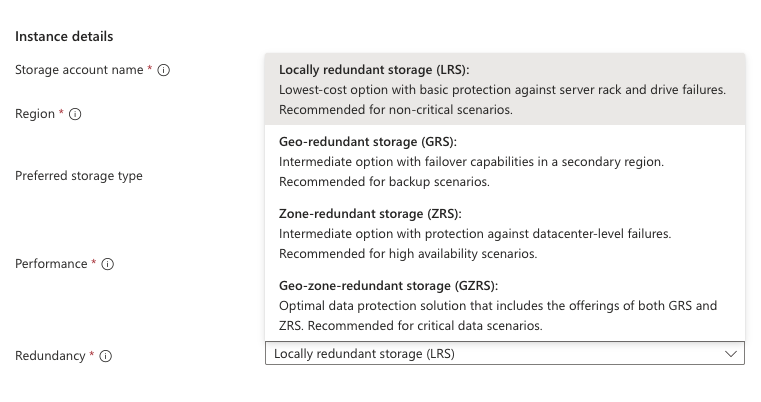
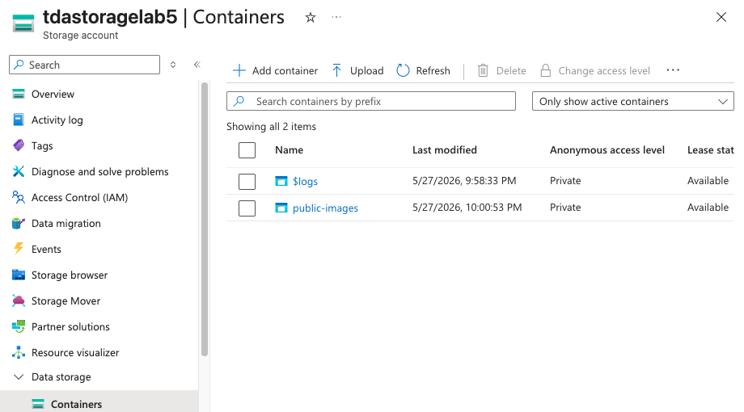
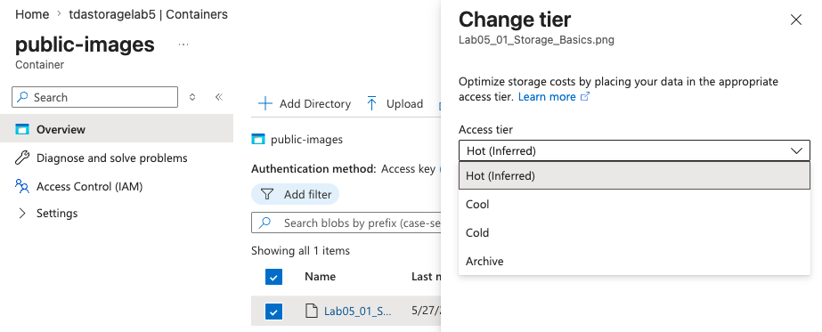

# Lab 05: Azure Storage, Redundancy, and Tier Architecture

## Overview
Azure Storage Accounts provide scalable, highly available cloud storage for unstructured data (Blobs), file shares, and queues. 

This lab documents the provisioning of a core Storage Account and the architectural decision-making process behind **Data Redundancy** and **Access Tier Management**. Because hardware failures are an operational certainty, Microsoft forces architects to explicitly define data redundancy. Furthermore, effective FinOps requires managing the cost-speed tradeoff of how frequently that data is accessed.

## Real-World Constraints & Architecture
* **Global Naming Conventions:** Unlike typical cloud resources, Storage Account names must be globally unique across all Azure tenants and cannot contain special characters. This is because the resource name physically dictates the DNS routing for public endpoint access (e.g., `.blob.core.windows.net`).
* **Cost vs. Durability Optimization:** While Geo-Redundant Storage (GRS) provides the highest disaster recovery capabilities, it effectively doubles storage costs. To protect the project budget, this lab was architected using **Locally Redundant Storage (LRS)**, maintaining three synchronous copies of the data within a single datacenter rack.
* **FinOps Lifecycle Management:** Storing static or legacy data in a "Hot" tier results in unnecessary financial burn. This lab demonstrates manual intervention to shift blob data into cooler access tiers (Cool, Cold, Archive), paving the way for automated Lifecycle Management Policies in production environments.

## Execution & Logic

### Phase 1: Storage Provisioning & Containers
* Provisioned an isolated Resource Group (`TDA-Storage-RG`).
* Deployed a Standard general-purpose v2 Storage Account, ensuring regional placement within South Central US to align with subscription capacity.
* Initialized a foundational Blob Container (`public-images`) to serve as the logical root directory for unstructured data.

### Phase 2: Tier Optimization
* **The AZ-900 Concept:** Azure billing for storage is heavily influenced by Access Tiers. Hot tiers have high storage costs but low access costs, while Archive tiers are the reverse.
* Uploaded a test object to simulate application data and manually accessed the tier management interface.
* Demonstrated the ability to physically shift the data from the inferred Hot tier into cold storage (Archive), proving an understanding of cost-saving mechanisms for long-term data retention.

## Documentation & Assets

**1. Storage Account Baseline Configuration**  

**2. Data Redundancy Selection (LRS)**  

**3. Initialized Blob Container**  

**4. Storage Tier Optimization**  
