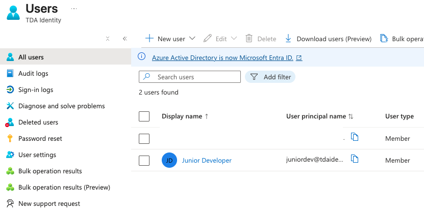
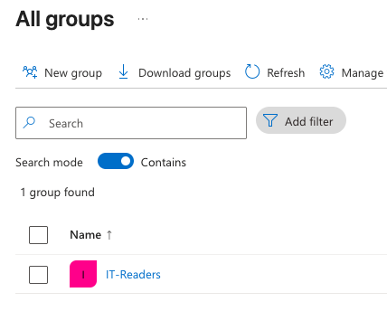
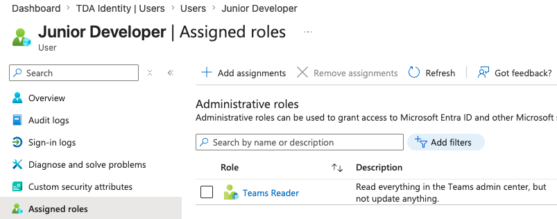

# Lab 06: Identity, Access, and Entra ID

## Overview
Identity is the new security perimeter in cloud architecture. This lab explores **Microsoft Entra ID** (formerly Azure AD), distinguishing between authentication (verifying identity) and authorization (verifying permissions). 

The execution of this lab required advanced tenant management, simulating how enterprise organizations isolate directories and implement Zero Trust principles.

## Real-World Constraints & Troubleshooting
* **Authorization Blocks (401 Errors):** Initial attempts to access the Entra ID portal within the primary academic subscription resulted in a `401 Unauthorized` error. This was caused by the root organization enforcing strict "Least Privilege Access," preventing standard users from viewing the global directory.
* **Tenant Isolation Strategy:** To bypass the organizational lock-out and gain Global Administrator privileges, I architected a completely isolated Entra ID Tenant (`TDA Identity`). 
* **Subscription Boundaries:** Confirmed the architectural boundary between Identity and Billing. Because the Azure for Students subscription (billing) remained attached to the primary academic tenant, the new isolated tenant could provision users and directory roles, but could not deploy infrastructure (Resource Groups) without an attached subscription.

## Execution & Logic

### Phase 1: Directory Provisioning & User Lifecycle
* Deployed a new Entra ID Tenant to serve as an isolated identity sandbox.
* Provisioned a simulated employee account (`Junior Developer`) to establish a baseline identity for access control testing.

### Phase 2: Group Management & Role Assignment
* **The AZ-900 Concept:** Best practice dictates that permissions are assigned to Security Groups, never directly to individual users. This ensures scalable lifecycle management.
* Created an `IT-Readers` Security Group and attached the new user.
* Navigated the distinction between Azure RBAC (infrastructure permissions) and Entra ID Roles (directory permissions) by explicitly assigning a directory-level administrative role (`Teams Reader`) to the user profile.

## Documentation & Assets

**1. Entra ID User Provisioning**  

**2. Security Group Configuration**  

**3. Administrative Role Assignment**  
