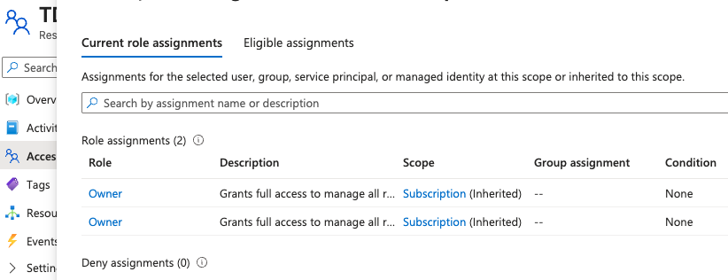
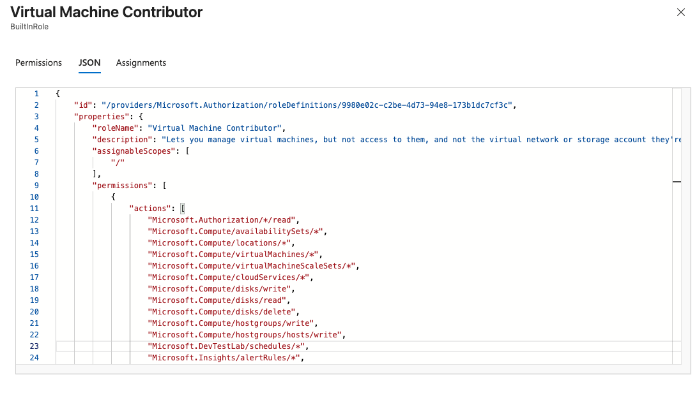
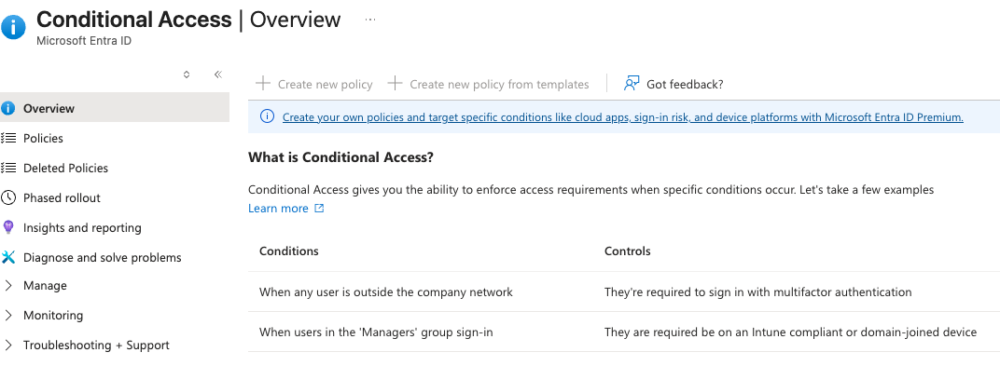

# Lab 07: RBAC Execution & Zero Trust Architecture

## Overview
Identity is only the first step in cloud security; authorization dictates what an identity can actually execute. 

This lab focuses on the practical implementation of **Role-Based Access Control (RBAC)** and the enforcement of the **Zero Trust Model** ("Verify explicitly, Use least privilege, Assume breach"). By exploring granular resource scopes and identity conditions, this lab demonstrates how to architect a multi-layered Defense in Depth strategy.

## Real-World Constraints & Architecture
* **Least Privilege Enforcement:** Rather than utilizing broad, foundational roles (Owner/Contributor), enterprise environments rely on highly specific granular roles (e.g., `Virtual Machine Contributor`) to minimize the blast radius of a compromised account.
* **Context-Aware Security:** While standard RBAC dictates what a user can do, **Conditional Access** dictates the circumstances under which they can do it. I explored the policy engine required to enforce contextual "If/Then" access rules.
* **Licensing Limitations (Documented):** Advanced Conditional Access policies require Entra ID Premium P1/P2 licensing. During the execution of this lab, the deployment of a location-based blocking policy was successfully modeled but physically restricted by the Entra ID Free tier associated with the student sandbox. Identifying and navigating business licensing constraints is a critical component of cloud architecture.

## Execution & Logic

### Phase 1: RBAC Auditing & Scope
* Navigated the Access Control (IAM) plane at the Resource Group scope.
* Audited the JSON definitions of granular roles to understand explicit `Actions` (allowed commands) and `NotActions` (explicitly denied commands), bridging the gap between graphical interfaces and underlying API permissions.

### Phase 2: Conditional Access Modeling
* Accessed the Entra ID Security blade to model a Zero Trust policy.
* Documented the architectural requirement for Premium identity licensing to enforce dynamic perimeter security (e.g., geographic blocking or unmanaged device restrictions).

## Documentation & Assets

**1. IAM Access Auditing**  

**2. Granular Least Privilege Roles (JSON)**  

**3. Conditional Access (Licensing Constraint)**  
