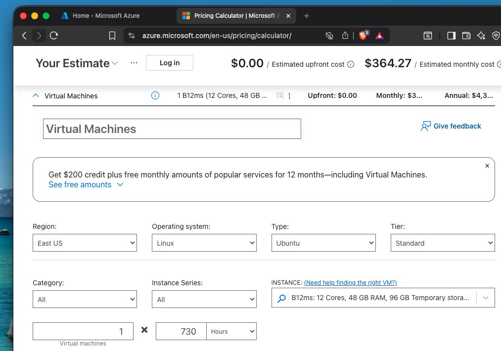
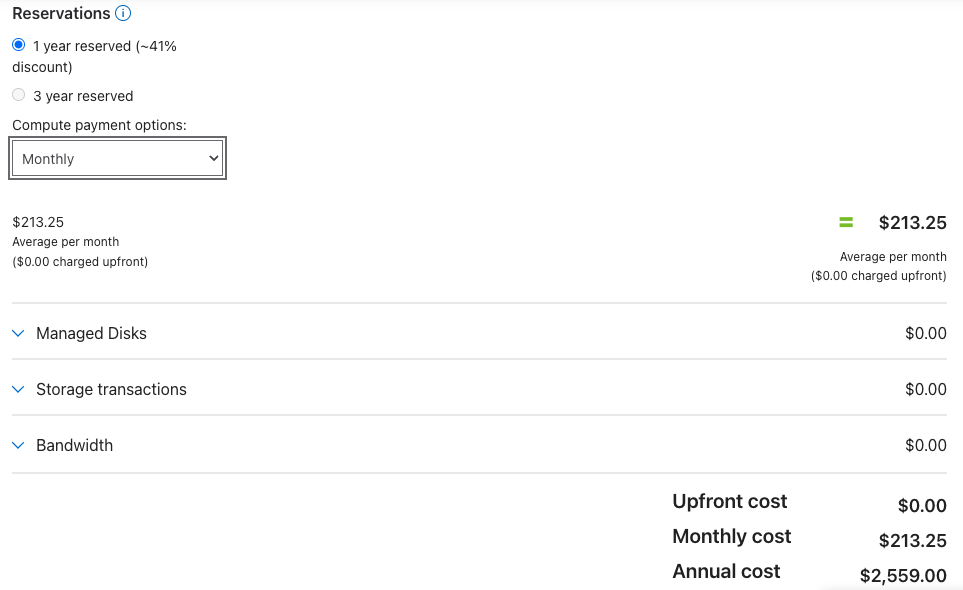
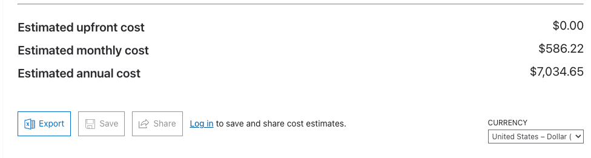
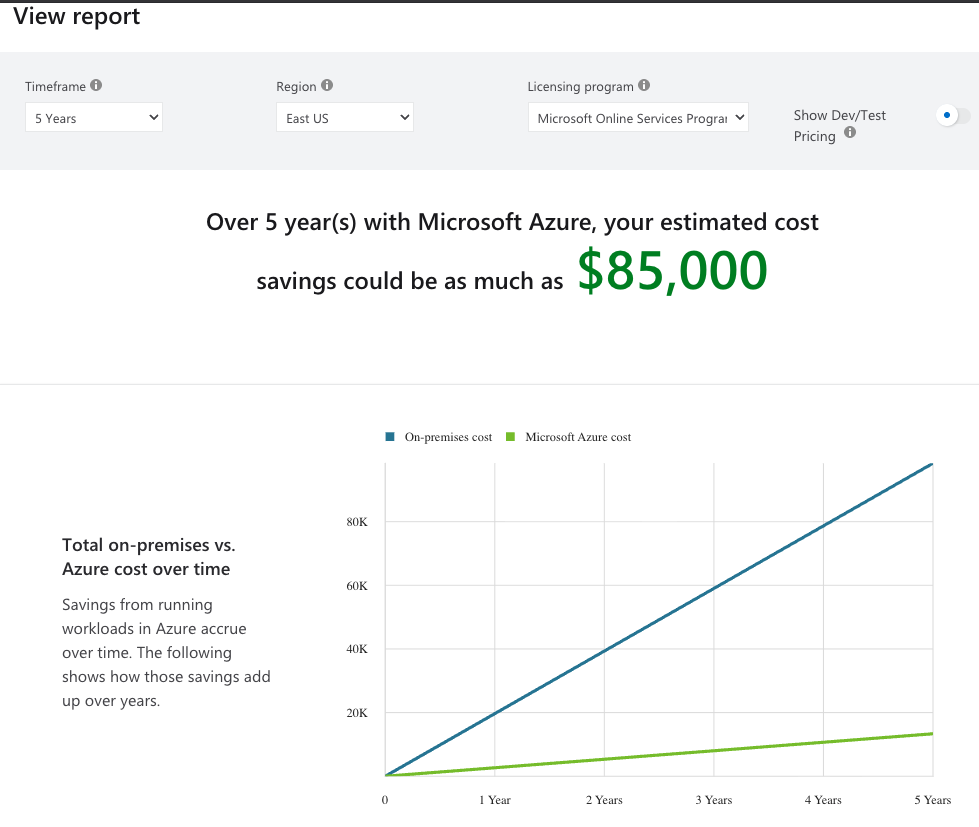
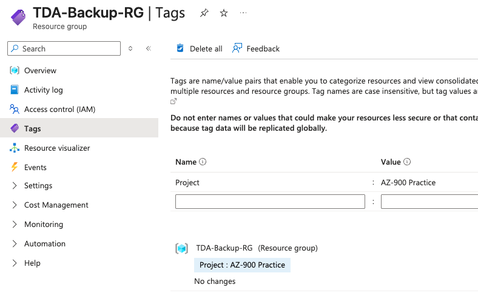
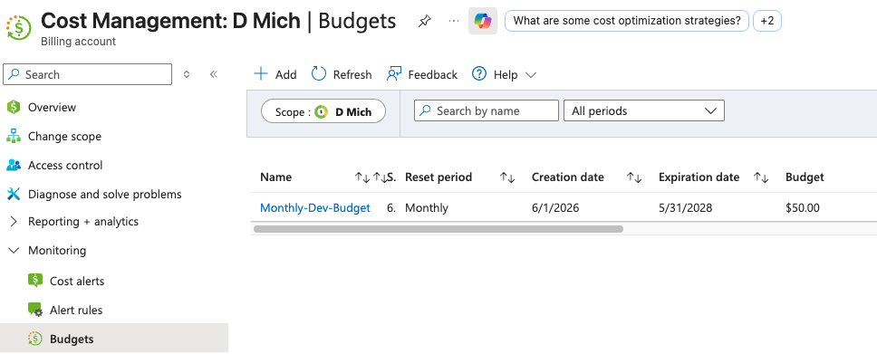

# Lab 08: Cost Estimation, Billing & FinOps Architecture

## Overview
Unlike on-premises datacenters driven by Capital Expenditure (CapEx), cloud architecture operates strictly on an Operational Expenditure (OpEx) consumption model. 

This lab demonstrates how to architect cost-effective solutions, forecast monthly cloud spend, and implement enterprise-grade financial guardrails. Accurate forecasting and automated alerting ensure IT projects align with business budgets and prevent unexpected resource consumption.

## Real-World FinOps Strategies
* **Reserved Instances:** By shifting from a "Pay-as-you-go" model to a 1-year committed reservation in the Pricing Calculator, I demonstrated how to secure massive compute discounts (~41%) for baseline, static workloads.
* **TCO vs. Pricing Estimations:** Documented the architectural difference between forecasting new infrastructure (Pricing Calculator) and calculating the financial viability of migrating physical datacenters to the cloud (Total Cost of Ownership Calculator).
* **Cost Allocation & Metadata:** Applied Resource Tags (`Project: AZ-900 Practice`) to ensure cloud spend can be accurately filtered, audited, and charged back to the correct internal business units.
* **Automated Guardrails:** Deployed hard budget constraints and proactive threshold alerts (triggering at 80% of budget capacity) to protect the subscription from runaway consumption.

## Execution & Logic

### Phase 1: Infrastructure Modeling & Export
* Modeled a frontend Linux Virtual Machine (IaaS) operating in the East US region, utilizing a `Standard_B12ms` burstable instance.
* Applied enterprise discounting mechanisms (1-year reserved).
* Consolidated the projected infrastructure costs and executed a financial export to serve as a formal budget request.

### Phase 2: Budgeting and Metadata (Simulation)
* Simulated the generation of a 3-year TCO migration report.
* Simulated the application of organizational metadata (Tags) at the Resource Group scope.
* Simulated the configuration of Cost Management budgets and proactive email alerting thresholds.

## Documentation & Assets

**1. Virtual Machine Sizing & Estimation**  

**2. Cost Optimization (Reserved Instances)**  

**3. Final Budget Projection & Export**  

**4. Migration Forecasting (TCO Report)**  

**5. Resource Tagging (Cost Allocation)**  

**6. Automated Budget Alerting**  
