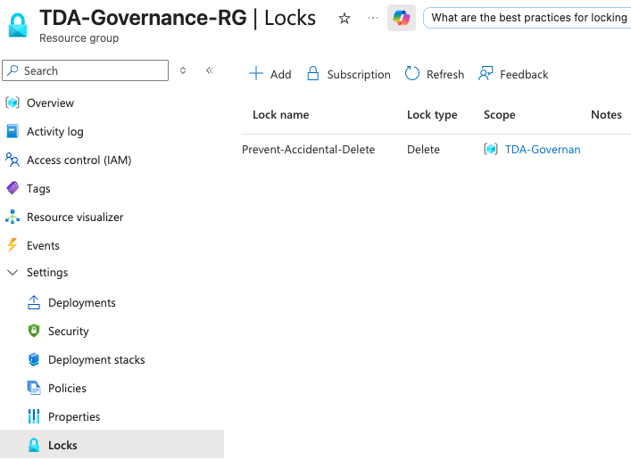
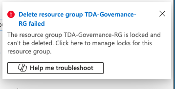
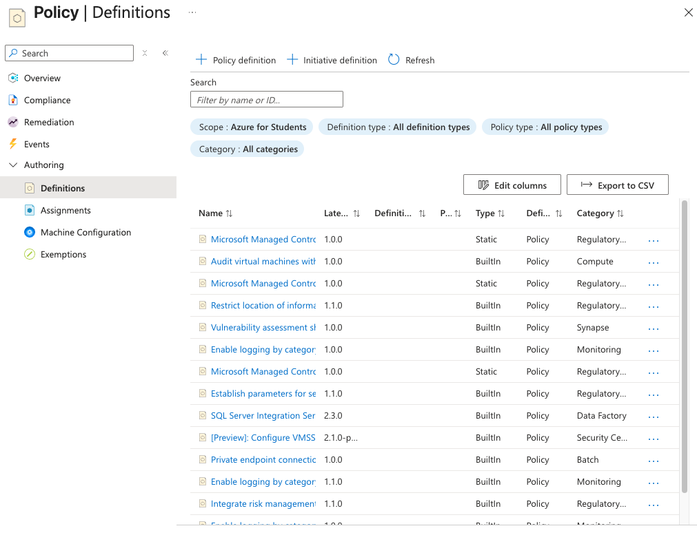

# Lab 09: Governance, Compliance & Safety Architecture

## Overview
While Identity (RBAC) dictates *who* has access to a cloud environment, Governance dictates *what* can actually be done with that access. 

This lab focuses on the implementation of foundational Azure governance tools. By deploying **Resource Locks** and auditing **Azure Policy**, this documentation demonstrates an understanding of how to protect critical production infrastructure from accidental deletion, rogue automation scripts, and deployment compliance violations.

## Real-World Governance Strategies
* **The RBAC vs. Governance Boundary:** Documented the architectural distinction that even accounts with Global Administrator or Owner privileges are completely overridden by Resource Locks. This ensures that human error cannot bypass physical infrastructure safeguards.
* **Policy-Driven Guardrails:** Audited the Azure Policy engine, which acts as the automated enforcement arm of cloud governance. In enterprise environments, Policy is used to automatically enforce naming conventions, restrict geographic deployments (data sovereignty), and mandate billing tags prior to resource creation.
* **Compliance Documentation:** Identified the separation of technical compliance (Microsoft Purview for data classification) and legal compliance (Service Trust Portal for formal ISO/GDPR audit reports).

## Execution & Logic

### Phase 1: Fail-Safe Deployment (Resource Locks)
* Provisioned an isolated Resource Group (`TDA-Governance-RG`) to serve as a target for governance testing.
* Applied a `CanNotDelete` Resource Lock at the scope of the Resource Group.
* Executed a destructive action (attempting to delete the container). The Azure Resource Manager successfully intercepted and blocked the command, throwing an explicit lock violation error. 

### Phase 2: Policy Auditing
* Navigated the Azure Policy plane to audit built-in compliance definitions, demonstrating familiarity with the central governance dashboard used by enterprise security teams.

## Documentation & Assets

**1. Resource Lock Implementation**  

**2. Destructive Action Blocked (Error Validation)**  

**3. Azure Policy Definitions**  
