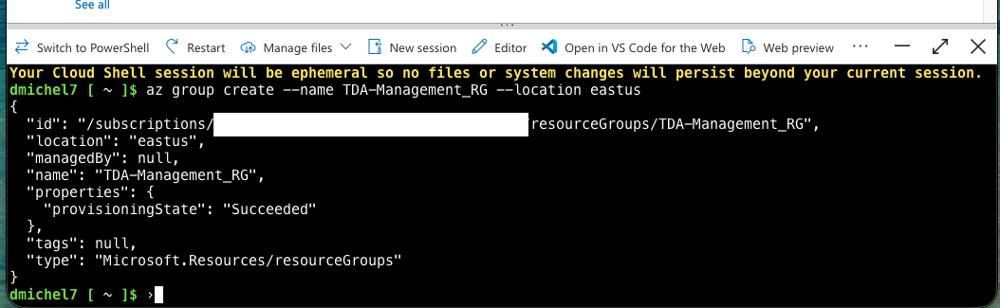
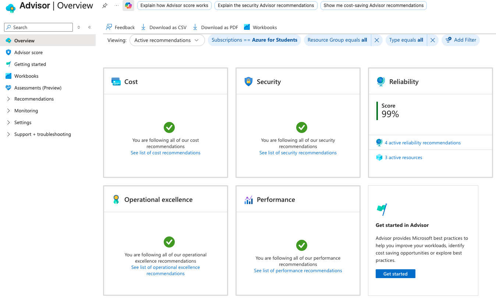
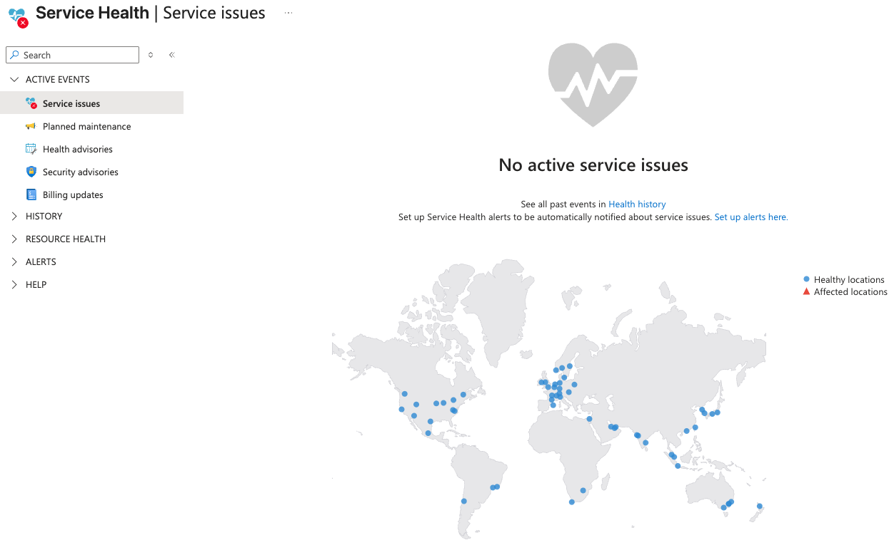

# Lab 10: Management Tools, Automation & Telemetry

## Overview
Managing enterprise-scale cloud real estate requires moving past manual GUI interactions and leveraging automated scripting, infrastructure as code, and proactive monitoring suites. 

This final lab documents execution across the **Azure Management plane**, utilizing browser-based command-line environments to provision infrastructure, and auditing the telemetry platforms used to maintain system health, cost control, and platform reliability.

## Real-World Operational Mechanics
* **Programmatic Resource Provisioning:** Demonstrated the pivot from the graphical Azure Portal to declarative command-line automation via the Azure CLI, establishing the foundational workflow required for Infrastructure as Code (IaC) and CI/CD pipelines.
* **Telemetry Distinction:** Modeled the operational boundaries between local infrastructure telemetry (**Azure Monitor** for resource-specific metrics and log ingestion) and cloud platform transparency (**Azure Service Health** for tracking regional datacenter outages and scheduled Microsoft maintenance).
* **Optimization Governance:** Audited **Azure Advisor** to analyze active cloud architecture against Microsoft's well-architected framework pillars (Cost, Security, Reliability, Performance, Operational Excellence).

## Execution & Logic

### Phase 1: Command-Line Orchestration (Cloud Shell)
* Initialized an authenticated **Azure Cloud Shell** session utilizing a Bash environment.
* Executed a programmatic resource group deployment using native Azure CLI syntax (`az group create`), completely bypassing the graphical portal wizard.

### Phase 2: Platform Diagnostics & Health Auditing
* Accessed the Azure Advisor control plane to review automated optimization recommendations.
* Audited the Azure Service Health dashboard, simulating the standard incident response workflow used by network operations centers (NOCs) to triage suspected regional fabric degradation.

## Documentation & Assets

**1. Azure CLI Command-Line Deployment**  

**2. Azure Advisor Optimization Matrix**  

**3. Global Service Health Status Dashboard**  
